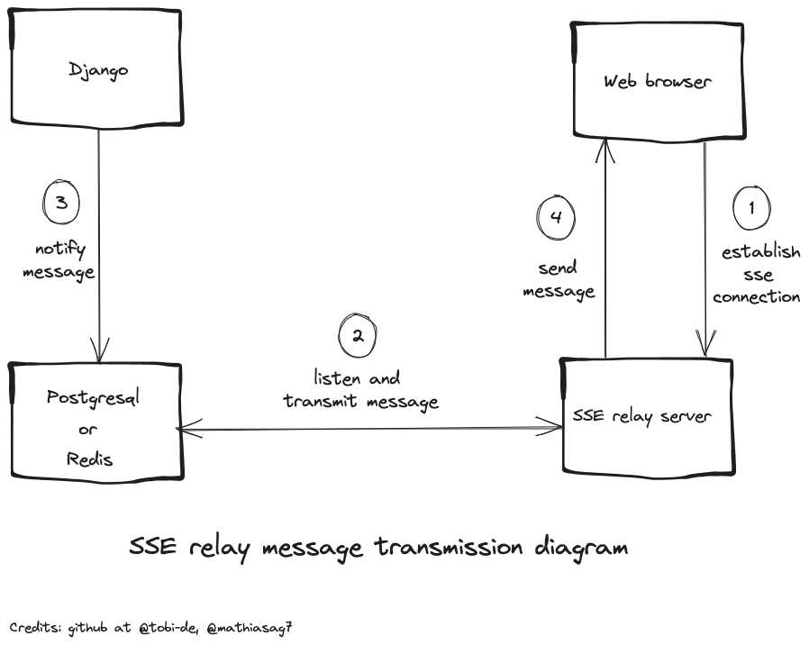

# sse-relay-server (wip)

For some background https://github.com/Tobi-De/sse_server_postgres_listen_notify



## Installation

As a package
```sh
pip install sse-relay-server
```
As a container
```sh
docker pull ghcr.io/tobi-de/sse_relay_server:main
```
