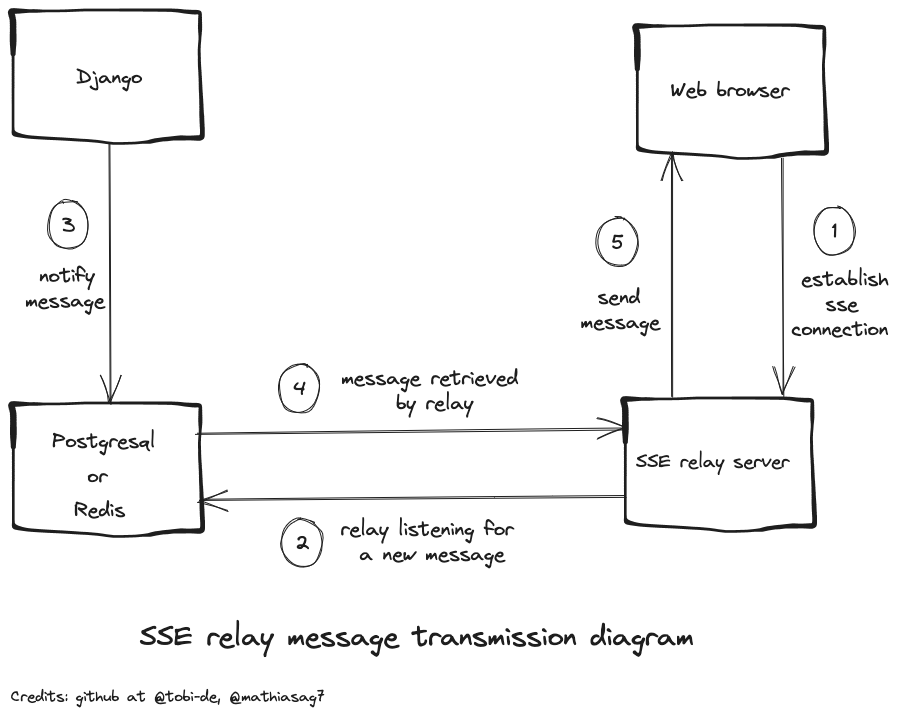

# sse-relay-server

[](https://github.com/Tobi-De/sse_relay_server/actions/workflows/docker-publish.yml)
[](https://pypi.org/project/sse-relay-server/)
[](https://github.com/psf/black)
[](https://github.com/Tobi-De/fuzzy-couscous/blob/main/LICENSE)
[](https://github.com/Tobi-De/sse_relay_server/pkgs/container/sse_relay_server)

For some background information, read https://github.com/Tobi-De/sse_server_postgres_listen_notify.

Originally designed for Django, now a simple, standalone Server-Sent Events relay service, ideal for Django projects
seeking
straightforward real-time capabilities without the need for Daphne and async Django setup.



<details>
<summary>Explanation</summary>

1. The browser establishes an SSE connection to the running relay service (this project).
2. The relay service listens on the channel specified in the user request via the path parameter `channel`.
3. When a user action occurs on your Django server, you run the [`notify`](#sending-messages-from-your-django-app) function, sending an event to either `PostgreSQL` or `Redis` based on your configuration.
4. The relay service receives the message from the broker (`Redis`/`PostgreSQL`).
5. Subsequently, the relay sends the message via SSE to all web browsers subscribed to the specified channel.

</details>

## Installation

You can install sse-relay-server as a package using pip:

```sh
pip install sse-relay-server
```

Alternatively, you can use a container by pulling the Docker image:

```sh
docker pull ghcr.io/tobi-de/sse_relay_server:latest
```

## Supported Protocols

- PostgreSQL [LISTEN](https://www.postgresql.org/docs/current/sql-listen.html)/[NOTIFY](https://www.postgresql.org/docs/15/sql-notify.html)
- Redis [Pub/Sub](https://redis.io/topics/pubsub)

## Environment Variables

To configure sse-relay-server, you can use the following environment variables:

- `ALLOWED_ORIGINS`: Comma-separated URLs allowed to request SSE connections.
- `DATABASE_URL`: PostgreSQL database URL.
- `REDIS_URL`: Redis URL (if you prefer to use Redis instead of PostgreSQL).
- `RELAY_USE_PG`: Force the use of PostgreSQL if you have both `REDIS_URL` and `DATABASE_URL` set, but prefer to use PostgreSQL.
- `RELAY_SERVER_DEBUG`: Boolean for enabling debug mode (default to False).
- `LOG_LEVEL`: CRITICAL | ERROR | WARNING | INFO | DEBUG | TRACE   (default to INFO)

If the `REDIS_URL` environment variable is set, the redis pubsub protocol will be used instead of the PostgreSQL
listen/notify.

## Running the Relay Service

If installed via pip, simply execute the following command, adjusting the options as needed:

```sh
sse-relay-server --port 8001 --host 0.0.0.0 --workers 4
```

For Docker users, override the running command as follows:

```sh
docker run -it sse_relay_server sse-relay-server --port 8001 --host 0.0.0.0 --workers 4
```

## Establishing an SSE Connection with the Relay Service

```javascript
const channelName = "NOTIFICATIONS"
const severURL = "http://<server_host>:<relay_port>"

const eventSource = new EventSource(`${serverURL}/channel=${channelName}`);

eventSource.addEventListener('NEW_NOTIFICATION', (e) => {
    console.log(e.data)
})
```

## Sending Messages from Your Django App

Once you've installed this package in your Django project, you can use a simple `notify` function to send messages. This
function works for both Redis and PostgreSQL.

```python
from sse_relay_server import notify

notify(
    channel="Notifications",
    sse_payload={
        "event": "NEW_NOTIFICATION",
        "id": 1,
        "data": json.dumps({"message": "A new notification"}),
    },
)
```

- `channel`: The PostgreSQL/Redis channel for sending the message.
- `sse_payload`: A Python dictionary containing all the details of the SSE event. For a complete list of available
  options, refer to [this class definition](https://github.com/sysid/sse-starlette/blob/main/sse_starlette/sse.py#L50).

To ensure smooth operation, avoid using excessively lengthy channel names, overly large payloads for PostgreSQL `NOTIFY`
messages, and bulky data for SSE event payloads, as there are size limitations for each of these aspects. If you need to
retrieve a large database object, consider sending just the key and fetching the full data on the frontend using another
request (such as an htmx request). While this extra request may not be the most ideal solution, for simplicity's sake,
it's often a worthwhile trade-off.

At my workplace, we successfully implemented a straightforward real-time notification system using this approach,
transmitting all the necessary notification data without any issues. However, be aware of the potential risk of sending
overly large data. For more in-depth information, you can refer to the following links:

- [PostgreSQL NOTIFY](https://www.postgresql.org/docs/15/sql-notify.html)
- [PostgreSQL LISTEN](https://www.postgresql.org/docs/current/sql-listen.html)
- [Server-Sent Events](https://developer.mozilla.org/en-US/docs/Web/API/Server-sent_events/Using_server-sent_events)
- [Redis Pub/Sub](https://redis.io/topics/pubsub)

If for some reason you don't want or cannot install this package, the code for sending events for both PostgreSQL and
Redis is quite simple, and you can easily copy and paste it from below.

### Postgres

```python
import json
from django.db import connection


def notify(channel: str, sse_payload: dict) -> None:
    with connection.cursor() as cursor:
        cursor.execute(f"NOTIFY {channel}, '{json.dumps(sse_payload)}'")
```

### Redis

```python
import json
import redis

REDIS_URL = "redis://localhost:6379/0"


def notify(channel: str, sse_payload: dict) -> None:
    r = redis.from_url(REDIS_URL)
    r.publish(channel=channel, message=json.dumps(sse_payload))
```

## Stopping the SSE Connection

As far as I know, there is no standard method for stopping an established SSE connection. The most straightforward solution is to send a specific event, such as one named `STOP`, and handle it on the frontend.
